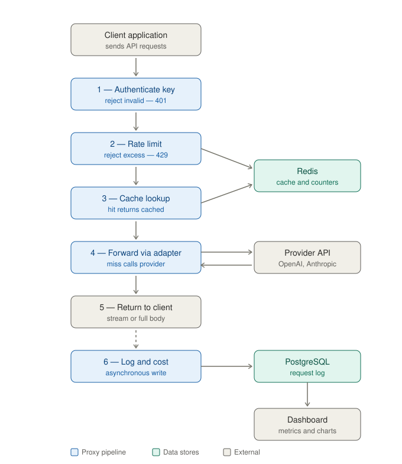

# TAP — Token Analytics Proxy

**An LLM gateway and observability proxy.**

A self-hosted reverse proxy that sits between an application and large language model provider APIs — forwarding every request transparently while recording, caching, rate-limiting, and reporting on the traffic that passes through it.

## Overview

Applications that call an LLM provider directly gain a capability but lose visibility — the cost of each call, its latency, and its failure characteristics are opaque unless they are measured at the boundary. This project introduces that boundary. It is a single ingress through which all model traffic is routed; each request is forwarded to the upstream provider unchanged, and the full request, response, token counts, computed cost, and latency are persisted before the response is returned to the caller. On top of the recording layer, the proxy adds response caching, per-key rate limiting, and an analytics dashboard.

The design premise is that the operational layer and the feature set are the same system — the persistence, the metrics, and the deployment are not additions to the product but its substance. A proxy with no persistent store has nothing to report; a dashboard with no aggregation has nothing to show.

## Motivation

LLM API usage exhibits three properties that make a governance layer worthwhile — cost that varies non-trivially across models and token counts, latency that is high and variable relative to conventional API calls, and a request-response payload that is expensive to reproduce and therefore valuable to cache. A gateway that observes every call converts these properties from unmeasured externalities into first-class, queryable metrics — and provides a single point at which access control, caching, and rate limiting can be enforced without modifying the calling application.

## Architecture

The request lifecycle is the design. The ordering of the pipeline stages — authentication, then rate limiting, then cache lookup, then forwarding, then logging — is deliberate, and reflects a policy of rejecting or short-circuiting work as early as possible.

A request arrives bearing a proxy-issued API key. The proxy authenticates the key and resolves it to a project — rejecting unauthenticated callers before any further work. It then checks the caller's rate budget, rejecting excess requests with a 429. On passing both gates, the proxy computes a deterministic key for the request and consults the cache — a hit returns the stored response without contacting the provider. On a miss, the request is forwarded to the upstream provider through a provider-specific adapter, the response is returned to the caller — streamed or buffered — and the full record, including computed cost and measured latency, is written to the ledger asynchronously so that persistence never sits on the response path.

## Request lifecycle

The stages, in order — each is a discrete, independently testable unit of the middleware:

1. Authentication — resolve the presented key to a project, or reject with 401.
2. Rate limiting — enforce a per-key request budget backed by Redis counters, or reject with 429.
3. Cache lookup — hash the canonicalized request and return a stored response on a hit.
4. Forwarding — relay the request to the upstream provider through an adapter and measure latency.
5. Response — return the provider's response to the caller, either buffered or as a passthrough stream.
6. Logging — compute token counts and cost, then write the complete record to PostgreSQL out of band.

## Core capabilities

- Transparent forwarding — the caller changes only the base URL; existing provider SDKs operate unmodified.
- Structured request logging — full request and response bodies, model, token counts, cost, latency, and status persisted per call.
- Response caching — identical requests are served from Redis, eliminating redundant provider spend.
- Per-key rate limiting — request budgets enforced independently for each issued key.
- Cost computation — per-model, input-and-output token pricing applied to every recorded call.
- Latency metrics — median and tail latency, including time-to-first-token for streamed responses.
- Analytics dashboard — call volume, cost by model, latency distribution, cache hit rate, and error rate.
- Proxy-issued API-key authentication — issued keys are stored hashed and resolved to projects on each request.

## Technology stack

| Layer | Technology | Purpose |
| --- | --- | --- |
| API and proxy | FastAPI, httpx | Asynchronous ingress and upstream forwarding |
| Language | Python 3.11+ | Backend implementation |
| Persistence | PostgreSQL, SQLAlchemy 2.0 (async), asyncpg | Request ledger and analytical queries |
| Cache and limiter | Redis | Response cache and per-key rate counters |
| Configuration | pydantic-settings | Environment-based configuration |
| Dashboard | React, TypeScript, Vite | Analytics user interface |
| Charts | Recharts | Time-series and categorical visualization |
| Server state | TanStack Query | Data fetching and cache synchronization |
| Styling | Tailwind CSS | Interface styling |
| Runtime and deployment | Docker Compose, Fly.io or Railway | Local orchestration and hosting |

## Data model

Two tables carry the system. The request ledger records one row per forwarded call — identifier, timestamp, project, provider, model, endpoint, status code, input and output token counts, computed cost, total latency, time-to-first-token, cache-hit flag, and the full request and response bodies stored as JSONB. The key registry records issued credentials — identifier, project name, a hash of the key, creation time, rate budget, and an active flag. The real key material is never persisted; only its hash is stored, and only the hash is compared on each request.

## Metrics

The dashboard is derived entirely from the ledger through aggregation. Call volume is bucketed over time with `date_trunc`; cost by model is a grouped sum; latency percentiles — the median and the 95th — are computed with PostgreSQL's `percentile_cont` ordered-set aggregate; cache hit rate and error rate are ratios over the same rows. No metric is stored separately from the underlying records — each is a query.

## Running locally

The backend, PostgreSQL, and Redis are orchestrated with Docker Compose; the dashboard runs against the backend's metrics API. Provider credentials and connection settings are supplied through environment variables — see the example environment file. Full setup steps are maintained in the repository.

## Project status and future work

The forwarding path, persistence layer, and dashboard constitute the current scope. Planned extensions — in order of priority — are streamed-response support with time-to-first-token accounting, additional provider adapters beyond the OpenAI-compatible surface, token-based rate limiting in addition to request-based limits, and pre-aggregated retention rollups for long-horizon analytics.
